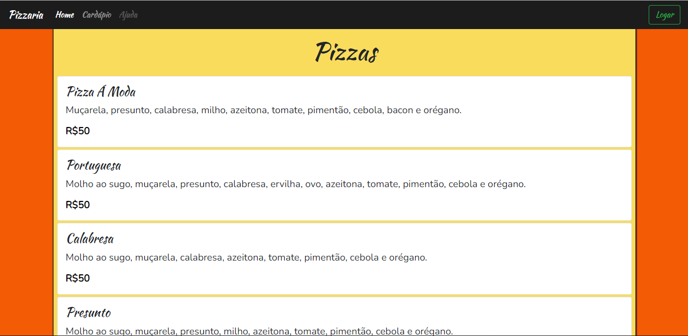
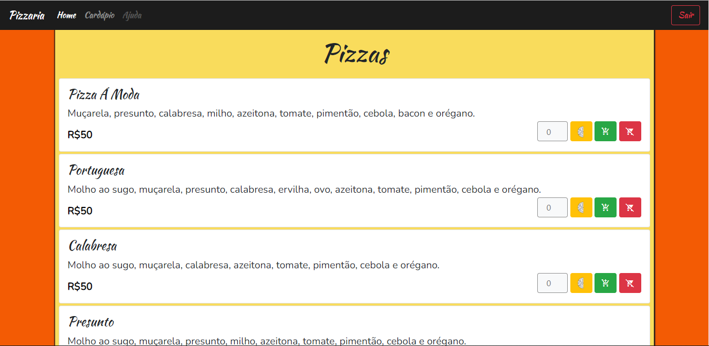
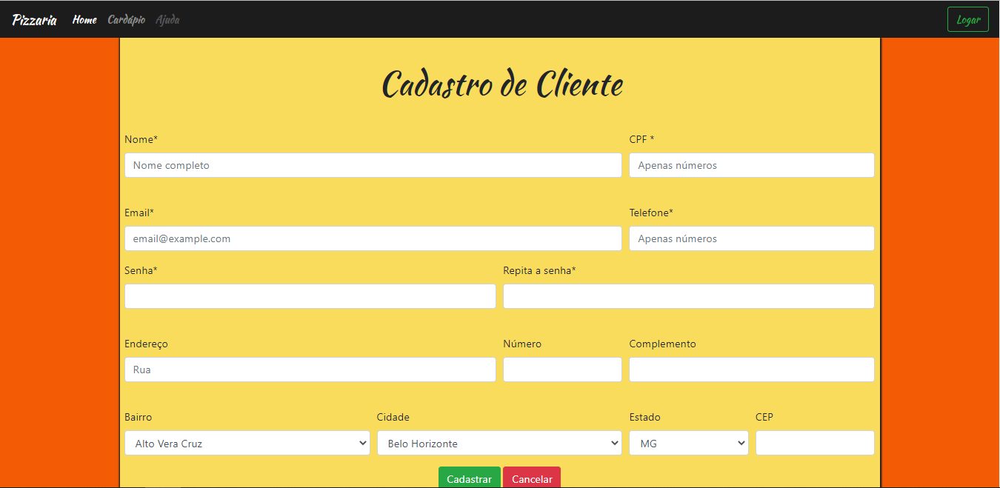
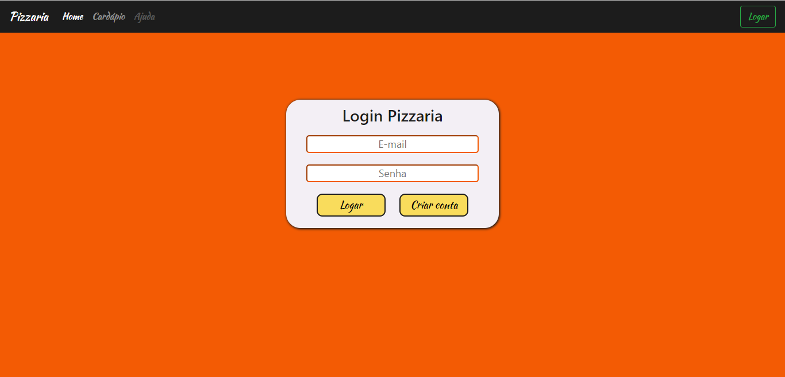

# TP1-EngSoft
Este projeto é um trabalho da matéria de Engenharia de Software do Cefet-MG. 

Neste trabalho, foi desenvolvido uma aplicação web para uma pizzaria, na qual o cardapio é carregado, apartir de opções de um banco de dados, hospedados em coleções do mongo atlas(banco de dados não relacional).

## Autores
 - GUILHERME NOGUEIRA COELHO, 20183011834
 - ELAINE RODRIGUES DOS SANTOS, 201322040494
 - PABLO HENRIQUE SANTOS, 20183012250

## Como utilizar
- Clone o repositório com **git clone https://github.com/pablohsgc/TP1-EngSoft.git**
- Entre na pasta **TP1** e execute **node app.js**
- O servidor será executado na porta 3000.
- Acesse **localhost:3000** e veja a aplicação rodando.

## Páginas
### Home
Página contendo o cardápio de uma pizzaria. As opções de compra só podem ser acessadas quando um usuário logar na aplicação.

### Cadastro
Página para que um usuário do serviço da pizzaria possa ser cadastrado.

### Login
Página para que um usuário possa logar na aplicação.

## Técnologias
 - NodeJS
 - Java Script
 - Handlebars
 - Express
 - Mongoose
 - MongoDB

## Deploy
 - Heroku
 - Link: https://serene-dawn-35795.herokuapp.com/